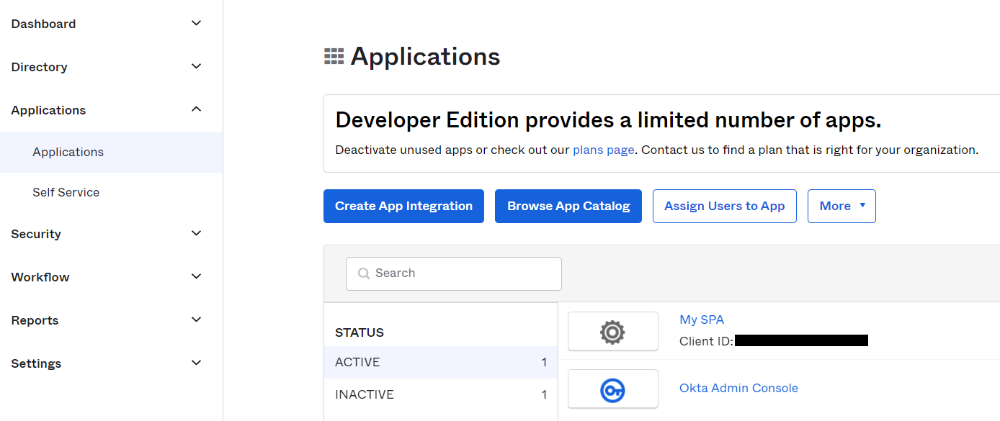
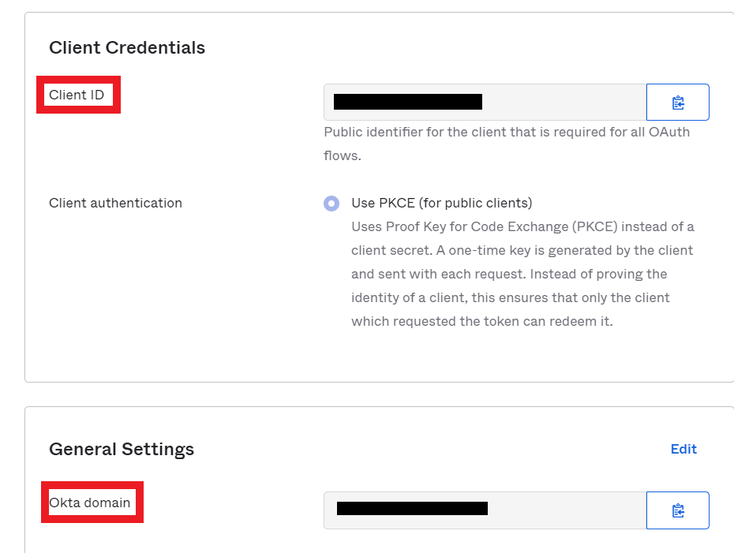

1. Zarejestruj się na Okta developer:
https://developer.okta.com/signup/
2. Założenie konta daje nam dostęp do panelu admina:

3. Po kliknięciu na create app integration pojawi się modal, w którym wybieramy OpenID Connect sign-in method, która udostępnia widget do logowania. Nasza aplikacja to Single Page Application, więc również zaznaczamy tę opcję

4. Klikamy next i zostaniemy przeniesieni do panelu integracji.
Aby skorzystać z Okty używając OpenID Connect sign-in method musimy zdefiniować login callback i przekierowanie na wylogowaniu. Podczas logowania jesteśmy przekierowywani na hostowany przez Okte widget do logowania. Nasza aplikacja napisana w React domyślnie tworzy się na porcie 3000, taki też port podajemy w konfiguracji. W assignments zaznaczamy skip group assignment for now i zapisujemy konfiguracje

5. Jeśli jeszcze nie masz stworzonej aplikacji to stwórz ją za pomocą ```npx create-react-app```
6. Do aplikacji doinstaluj paczkę Okta SDK, Okta Auth JavaScript SDK, okta signin-widget oraz react-router-dom:
```npm install --save @okta/okta-auth-js @okta/okta-react react-router-dom @okta/okta-signin-widget```
7. Tworzymy plik .env w rootPath (pamiętaj o umieszczeniu go w .gitignore) z danymi konfiguracyjnymi. Zmienne środowiskowe w React muszą zaczynać się od REACT_APP


```
REACT_APP_OKTA_DOMAIN=<YOUR_OKTA_DOMAIN>
REACT_APP_CLIENT_ID=<YOUR_CLIENT_ID>
REACT_APP_CALLBACK_PATH=/dashboard
REACT_APP_ISSUER=https://<YOUR_OKTA_DOMAIN>/oauth2/default
REACT_APP_HOST=localhost:3000
```
Dane domeny oraz client ID znajdziesz w konfiguracji aplikacji po kliknięciu na nią w panelu applications:

Po kliknięciu zostaniemy przekierowani na poniższą stronę:

8. W pliku App.js importujemy BrowserRouter oraz przyszły plik AppWithRouterAccess:
```js
import React from "react";
import { BrowserRouter as Router } from "react-router-dom";
import AppWithRouterAccess from "./AppWithRouterAccess";

const App = () => {
  return (
    <Router>
      <AppWithRouterAccess/>
    </Router>
  );
};
export default App;
```
Tworzymy obiekt konfiguracyjny config.js, a następnie podejemy go do okty.
```js
const CLIENT_ID = process.env.REACT_APP_CLIENT_ID;
const CALLBACK_PATH = process.env.REACT_APP_CALLBACK_PATH;
const ISSUER = process.env.REACT_APP_ISSUER;
const HOST = process.env.REACT_APP_HOST;
const DOMAIN = process.env.REACT_APP_OKTA_DOMAIN;

if (!CLIENT_ID || !CALLBACK_PATH || !ISSUER || !HOST) {
  throw new Error("All environmental variables must be set");
}

export const oktaAuthConfig = {
  // Note: If your app is configured to use the Implicit flow
  // instead of the Authorization Code with Proof of Code Key Exchange (PKCE)
  // you will need to add `pkce: false`
  issuer: `https://${DOMAIN}/oauth2/default`,
  clientId: `${CLIENT_ID}`,
  redirectUri: window.location.origin + "/login/callback",
};

export const oktaSignInConfig = {
  baseUrl: `https://${DOMAIN}`,
  clientId: `${CLIENT_ID}`,
  redirectUri: window.location.origin + "/login/callback",
  authParams: {
    // If your app is configured to use the Implicit flow
    // instead of the Authorization Code with Proof of Code Key Exchange (PKCE)
    // you will need to uncomment the below line
    // pkce: false
  },
  // Additional documentation on config options can be found at https://github.com/okta/okta-signin-widget#basic-config-options
};
```
Następnie komponentem Security owrapujemy naszą aplikację i jej routy, aby dostęp do wybranych został zabezpieczony.
Obiekt oktaAuth służy do zmiany lub odczytywania informacji o stanie autentykacji uzytkownika. Obiekt oktaAuth zawiera:
* isAuthenticated - zmienna logiczna przechowująca dane o stanie autentykacji. Jest prawdziwa jeśli idToken i accessToken są w tokenManager
* accessToken - JWT access token przypisany do obecnego użytkownika,
* idToken - JWT Id token przypisany do obecnego użytkownika,
* error - zwracany gdy proces autentykacji nie powiedzie się,

Nie musimy pisać komponentu ProtectedRoute sami, okta dostarcza nam go w postaci SecureRoute.
Zaimplementujmy komponent AppWithRouterAccess, który będzie miał login buttona.
```js
import React from "react";
import { Route, useHistory, Switch } from "react-router-dom";
import { Security, SecureRoute, LoginCallback } from "@okta/okta-react";
import { OktaAuth, toRelativeUrl } from "@okta/okta-auth-js";
import Home from "./Home";
import Login from "./Login";
import Protected from "./Protected";
import { oktaAuthConfig, oktaSignInConfig } from "./config";

const oktaAuth = new OktaAuth(oktaAuthConfig);

const AppWithRouterAccess = () => {
  const history = useHistory();

  const customAuthHandler = () => {
    history.push("/login");
  };

  const restoreOriginalUri = async (oktaAuth, originalUri) => {
    history.replace(toRelativeUrl(originalUri, window.location.origin));
  };

  return (
    <Security
      oktaAuth={oktaAuth}
      onAuthRequired={customAuthHandler}
      restoreOriginalUri={restoreOriginalUri}
    >
      <Switch>
        <Route path="/" exact={true} component={Home} />
        <SecureRoute path="/protected" component={Protected} />
        <Route
          path="/login"
          render={() => <Login config={oktaSignInConfig} />}
        />
        <Route path="/login/callback" component={LoginCallback} />
      </Switch>
    </Security>
  );
};
export default AppWithRouterAccess;
```
Stwórzmy plik Home.js:
```js
import React from "react";
import { Link } from "react-router-dom";
import { useHistory } from "react-router-dom";
import { useOktaAuth } from "@okta/okta-react";

const Home = () => {
  const history = useHistory();
  const { oktaAuth, authState } = useOktaAuth();

  if (!authState) return null;

  const login = async () => history.push("/login");

  const logout = async () => oktaAuth.signOut();

  const button = authState.isAuthenticated ? (
    <button onClick={logout}>Logout</button>
  ) : (
    <button onClick={login}>Login</button>
  );

  return (
    <div>
      <Link to="/">Home</Link>
      <br />
      <Link to="/protected">Protected</Link>
      <br />
      {button}
    </div>
  );
};
export default Home;
```
Hook useOktaAuth daje nam dostęp do obiektu oktaAuth oraz authState.
Dzięki sprawdzeniu stanu użytkownika, możemy podpiąć do przycisku odpowiednie funkcje i text informujący go o danym zdarzeniu.
loginWithRedirect przekieruje usera na formularz logowania, a później na dashboard po poprawnym zalogowaniu.

Do wylogowania użytkownika musimy dodać w konfiguracji naszej aplikacji localhosta do listy zaufanych witryn. 
W panelu administracyjnym okta wchodzimy w Security > API > Trusted Origins

Klikamy Add Origin i zaznaczamy jak na screenie poniżej:


Aby móc się zalogować musimy dodać do naszej aplikacji w panelu administracyjnym okty użytkownika, a następnie przypisać go do aplikacji.
Directory>People>Add User

Wchodzimy w panel aplikacji za pomocą przycisku assigne możemy dodać użytkownika do aplikacji.

Po kliknięciu na przycisk login otrzymamy panel logowania, a po poprawnym zalogowaniu access token wraz z innymi dodatkowymi informacjami


źódła:
https://developer.okta.com/code/react/okta_react_sign-in_widget/